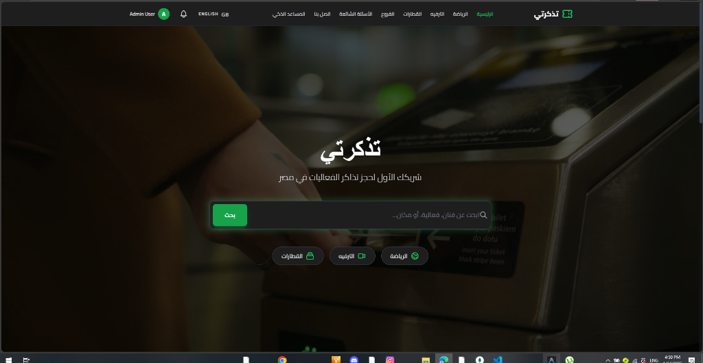
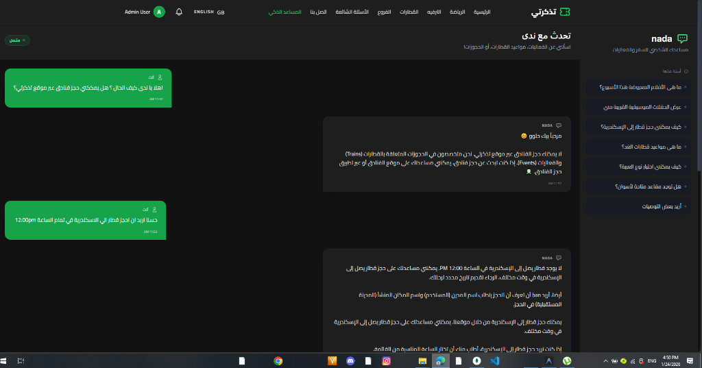
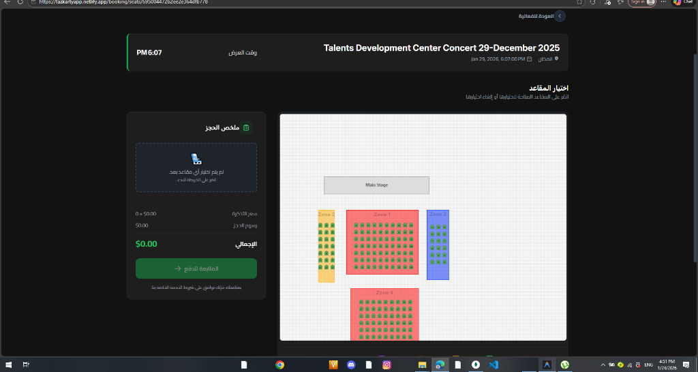
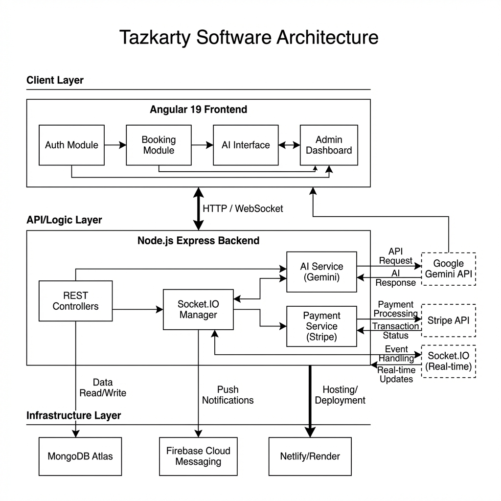
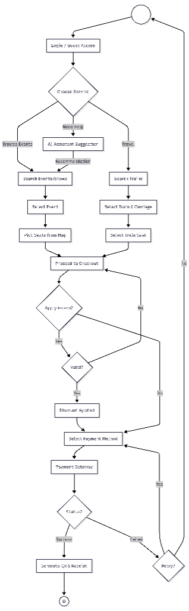
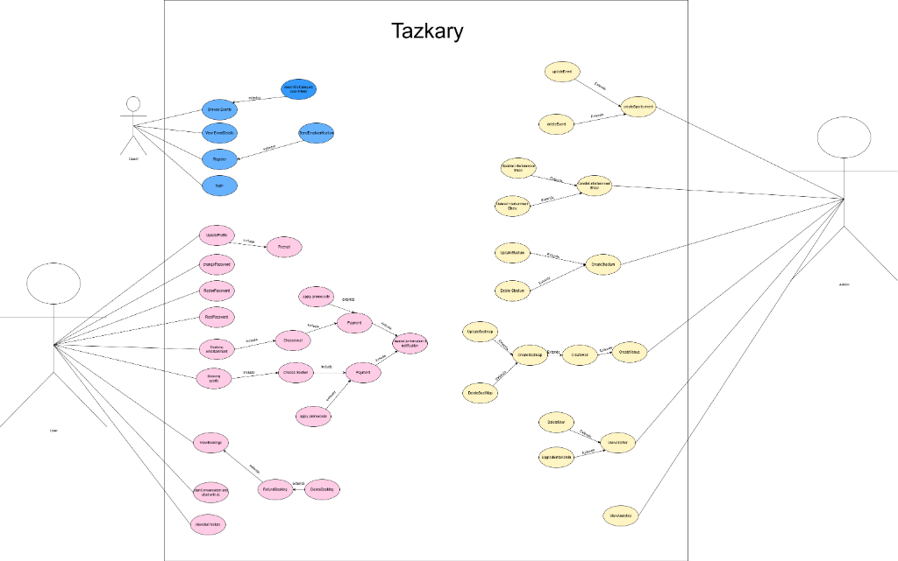
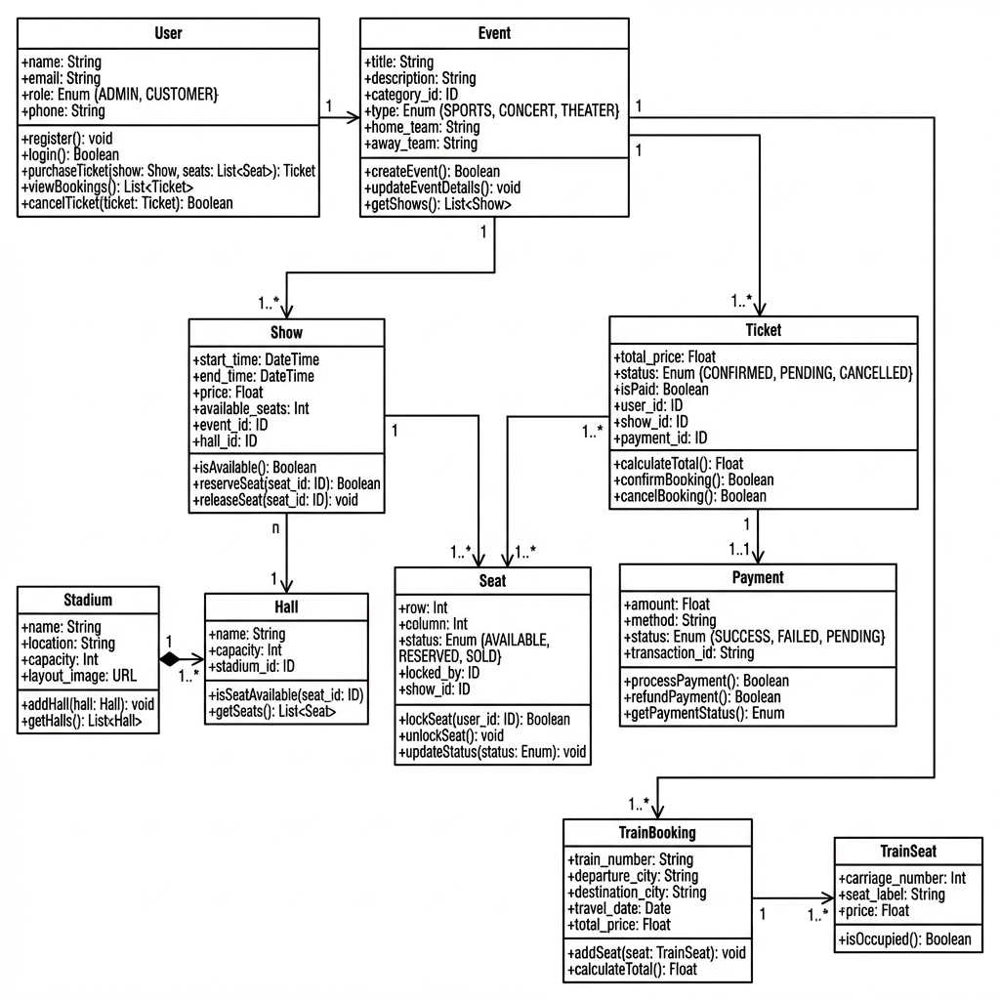
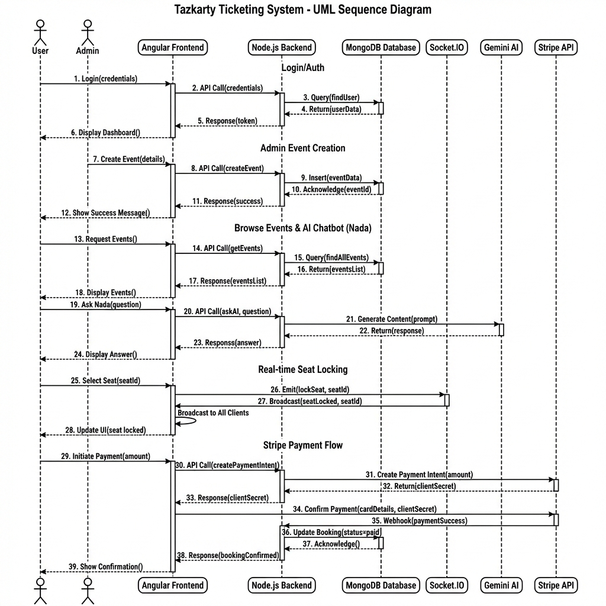
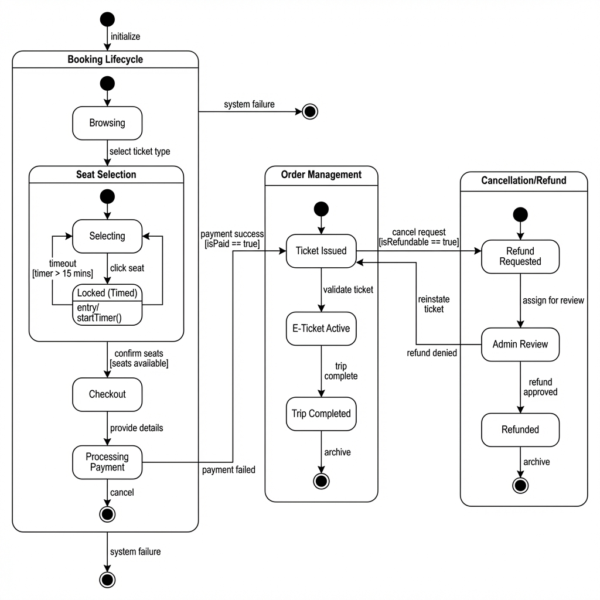

# Tazkarty - Smart AI Ticket Reservation System

[](https://tazkartyapp.netlify.app/)
[](https://angular.io/)
[](https://nodejs.org/)
[](https://www.mongodb.com/)

**Tazkarty** is a modern, state-of-the-art ticket reservation platform designed for the Egyptian market. It provides a seamless experience for booking sports matches (stadiums), entertainment shows, and train journeys, all enhanced by an integrated AI assistant.

---

## Key Features

### Smart AI Assistant (Nada)
*   **Conversational Booking:** Discover events and check availability through natural language.
*   **Intelligent Recommendations:** Get personalized match and show suggestions.
*   **24/7 Support:** Automated help for FAQs and booking guidance.

### Advanced Event Management
*   **Dynamic Seat Mapping:** interactive SVG-based seat selection for stadiums and theaters.
*   **Sports Focus:** Specialized flow for football matches, including team filters and stadium layouts.
*   **Real-time Availability:** Instant seat locking and status updates via Socket.IO.

### Premium Train Reservations
*   **Journey Planning:** Easy search for Cairo-based rail expeditions.
*   **Carriage Selection:** Visual maps for first-class, VIP, and standard carriages.
*   **National ID Integration:** Simplified verification for secure travel.

### Secure & Global
*   **Stripe Integration:** Fully secure payment processing.
*   **Bilingual (AR/EN):** Full RTL support for a native Arabic experience.
*   **Dark Mode Aesthetics:** Premium glassmorphism design optimized for all devices.

---

## Tech Stack

### Frontend
- **Framework:** Angular 19 (Standalone Components, Signals API)
- **Styling:** Tailwind CSS (Custom Design System)
- **State Management:** Angular Signals & RxJS
- **Real-time:** Socket.IO Client

### Backend
- **Runtime:** Node.js (Express.js)
- **Database:** MongoDB with Mongoose ODM
- **Authenticaton:** JWT (JSON Web Tokens)
- **AI Integration:** Hugging Face API (Meta-Llama-3-8B)

---

## Getting Started

### Prerequisites
- Node.js (v20+)
- MongoDB Atlas account or local installation
- Stripe Account (for payments)
- Hugging Face API Key (for the AI Assistant)

### Installation

1. **Clone the repository**
   ```bash
   git clone https://github.com/ZiadNader1/Tazkarty-Smart-Ai-Ticket-reservation-system-.git
   cd tazkarty
   ```

2. **Backend Setup**
   ```bash
   cd backend
   npm install
   # Create a .env file based on .env.example
   npm run dev
   ```

3. **Frontend Setup**
   ```bash
   cd ../Frontend/tazkarty-frontend
   npm install
   npm start
   ```

---

## Project Structure

```text
tazkarty/
├── backend/                # Node.js Express Server
│   ├── src/controllers/    # Business Logic
│   ├── src/models/         # Mongoose Schemas
│   ├── src/routes/         # API Endpoints
│   └── uploads/            # Local Asset Storage
├── Frontend/               # Angular 19 Application
│   ├── src/app/core/       # Guards, Services, Interceptors
│   ├── src/app/features/   # Feature modules (Auth, Events, Trains)
│   ├── src/app/shared/     # Reusable UI Components
│   └── public/             # Static Assets & SVGs
└── README.md
```

---

## Screenshots

| Home Page | AI Assistant (Nada) | Seat Selection |
| :---: | :---: | :---: |
|  |  |  |

---

## System Architecture & Engineering Design

Tazkarty is built using a layered **Micro-services inspired Architecture** that ensures separation of concerns, scalability, and real-time performance. Below is the **System Component Diagram** illustrating the interaction between various layers:



### Architectural Layers:

1.  **Client Layer (Angular 19):**
    *   **Auth Module:** Manages secure JWT-based sessions.
    *   **Booking Engine:** Handles complex seat selection and logic.
    *   **AI Interface:** Modern chat UI for real-time interaction with Nada AI.
    *   **Admin Dashboard:** Comprehensive orchestration for data management.

2.  **Logic Layer (Node.js & Express):**
    *   **RESTful Controllers:** Secure API endpoints for all CRUD operations.
    *   **Socket.IO Manager:** Real-time event emitter for instant seat synchronization.
    *   **Service Layer:** Dedicated services for Hugging Face AI integration and Stripe payment lifecycle.

3.  **Infrastructure & External Services:**
    *   **Database:** MongoDB Atlas for high-availability data storage.
    *   **AI:** Hugging Face API (Meta-Llama-3-8B) for Natural Language Processing.
    *   **Payments:** Stripe API for secure financial transactions.
    *   **Hosting:** Netlify (Frontend) & Render (Backend) with CI/CD integration.

---

## Core System Flow

To ensure a seamless user experience, Tazkarty implements a highly structured **Activity Flow**. This diagram illustrates the comprehensive user journey, including event booking, train reservations, and intelligent AI assistance:



### Key Technical Logic:
*   **Multi-Path Discovery:** Users can find events through traditional browsing or conversational AI suggestion.
*   **Real-time Locking:** Integrated database lock mechanism for seats during the checkout phase.
*   **Adaptive Billing:** Real-time promo code validation and dynamic price adjustment before gateway submission.

---

## User Interaction Model (Use Case)

The following **Use Case Diagram** outlines the functional requirements and the boundaries between the User, Admin, and integrated external systems (AI & Payments).



---

---

## Database Design (ERD)

Tazkarty uses a robust relational data model (documented here in Chen's Notation) designed for high data integrity and flexibility. The system distinguishes between general events and specific shows, allowing for complex scheduling and real-time seat management.

> [!TIP]
> **[Click here to view the Full High-Resolution ERD Diagram](screenshots/comprehensive_erd_diagram.png)**

<a href="screenshots/comprehensive_erd_diagram.png" target="_blank">
  
</a>

### Logical Schema Architecture:
- **Event-Show Separation:** Events act as templates, while Shows handle specific timing, pricing, and dynamic inventory.
- **Unified Inventory:** A flexible mapping system that supports both traditional Venues (Theaters/Cinemas) and large-scale Stadiums.
- **Transactional Integrity:** Integrated tracking for Bookings, Payments, and Promo Code utilization.
- **AI Context Support:** Dedicated entities for storing AI conversation history to provide personalized user assistance.

---

## Domain Model (Class Diagram)

To ensure a robust object-oriented design, Tazkarty follows a standardized **Class Schema**. This diagram illustrates the attributes, methods, and relationships (Associations, Compositions, and Dependencies) between the core entities.



---

## End-to-End Sequence

The following **Sequence Diagram** represents the end-to-end journey from user discovery to ticket generation:



---

## System State Management

To maintain consistency across the reservation lifecycle, Tazkarty utilizes a formal **State Machine** logic. This ensures that every booking, seat, and payment follows a strict, non-conflicting path from initialization to completion or cancellation.



### Operational States:
- **Booking Control:** Orchestrates the flow from 'Browsing' through 'Seat Selection' to final 'Ticket Issuance'.
- **Atomic Seat Locking:** Prevents double-booking by implementing a time-limited 'Locked' state before permanent commitment.
- **Financial Reconciliation:** Tracks transaction states with full support for gateway-driven callbacks and refund processing.

---

## Developer

Developed by **Ziad Nader**.

- **LinkedIn:** [Ziad Nader](https://www.linkedin.com/in/ziad-nader-5b86a2303/)
- **GitHub:** [@ZiadNader1](https://github.com/ZiadNader1)
- **Facebook:** [Ziad Nader](https://www.facebook.com/ziad.naderii)

*Special thanks to all the friends and colleagues who supported this vision.*

---

## License
This project is for educational and portfolio purposes. All rights reserved.
