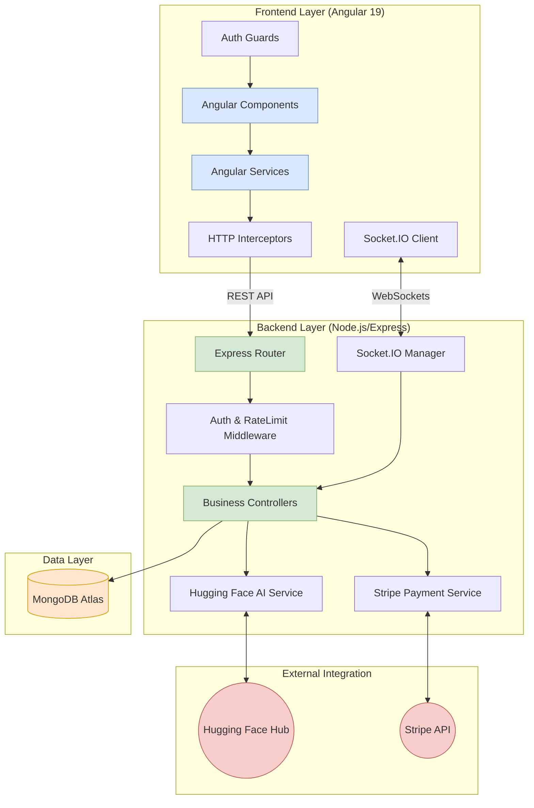

# Component Diagram - Tazkarty

This diagram illustrates the internal components of the Tazkarty system and how they interact with each other and external services.

## System Components

### Component Breakdown

1.  **Frontend Layer**:
    *   **Angular Components**: Modular UI elements (Seat Selection, AI Chat, etc.).
    *   **Angular Services**: Handle data fetching and logic orchestration.
    *   **Interceptors**: Automatically attach JWT tokens to every outgoing request.

2.  **Backend Layer**:
    *   **Express Router**: Decouples URL path logic from business logic.
    *   **Controllers**: Contain the core processing for events, bookings, and train journeys.
    *   **Socket.IO Manager**: Synchronizes seat status across all connected clients in real-time.

3.  **Data Layer**:
    *   **MongoDB Atlas**: Stores users, events, tickets, and AI conversations using a schema-less approach for flexibility.

4.  **External Integration**:
    *   **Hugging Face AI**: Powers the "Nada" assistant using Meta-Llama-3-8B.
    *   **Stripe**: Handles the secure financial lifecycle of every ticket purchase.
